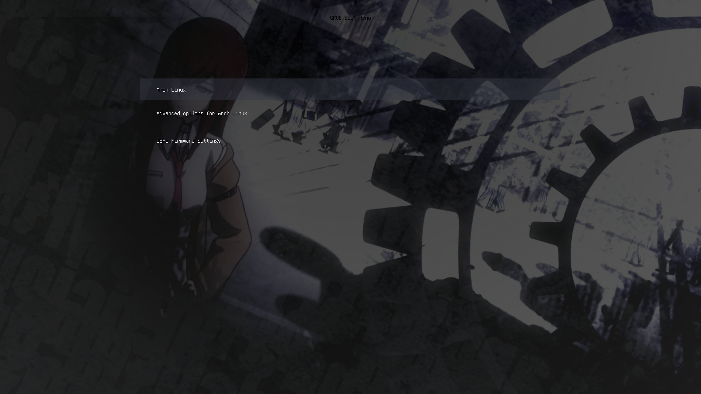

[](./README.md)

## Overview
Grub is custom Grub theme that changes the look and feel of the Grub bootloader.

## Installation
The initial installation of `nohashduck/grub` can be done by typing the following chain of commands.
```bash
git clone https://github.com/nohashduck/grub.git
sudo cp -r grub-theme/grub/theme /usr/share/grub/themes/grub
sudo sed -i "s/GRUB_THEME=.*/GRUB_THEME=\/usr\/share\/grub\/themes\/grub\/theme.txt/" /etc/default/grub
sudo grub-mkconfig -o /boot/grub/grub.cfg
```
If you want to do all of this at once, we can chain the commands like so:
```bash
git clone https://github.com/AlbertoLaizans/grub-theme.git && sudo cp -r grub-theme/grub/theme /usr/share/grub/themes/grub && sudo sed -i "s/GRUB_THEME=.*/GRUB_THEME=\/usr\/share\/grub\/themes\/grub\/theme.txt/" /etc/default/grub
 /etc/default/grub && sudo grub-mkconfig -o /boot/grub/grub.cfg
```
Note: sed command fixed from the original post
